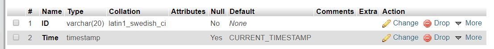
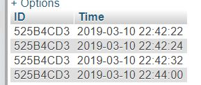

# attendance-tracker

## Setting up
- Install Node JS and Arduino IDE
- Install all dependencies by running `npm install`.
- Setup the database in driver.js 
<pre><code>//Setup mySQL database  
        var con = mysql.createConnection({  
          host: "localhost",  
  port: "3308",  
  user: "root",  
  password: "",  
  database: "attendance"  
});
</code></pre>
  
Table Structure 
  
- Connect the Arduino. Change the COM port in driver.js  (Open Arduino IDE then go to Tools > Port. You can check which COM port the Arduino is connected to) 
<pre><code>const port = new SerialPort('COM7', {  
  baudRate: 9600  
}); // change COM7 to the COM port where device is connected
</code></pre>

## Uploading the code to Arduino
(since the code is already uploaded to the device, you may skip this part)
- Install Arduino IDE.
- Download MFRC522 Library (https://www.arduinolibraries.info/libraries/mfrc522). 
- From the IDE, go to Sketch > Include Library > Add .zip library. Choose MFRC522-x.x.x.zip
- Upload the code from'RFIDTracker/rfidTracker.ino' to the Arduino.

## Running the project
- Run the project. type `node driver.js`. If everything goes smoothly, UID of each RFID tapped to the device is automatically uploaded to the database with corresponding timestamp.  
Sample 

